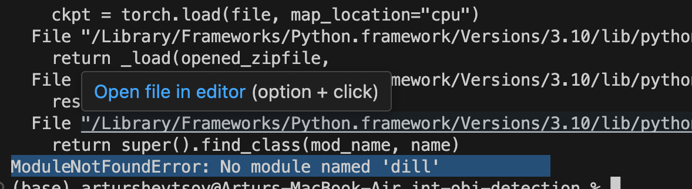
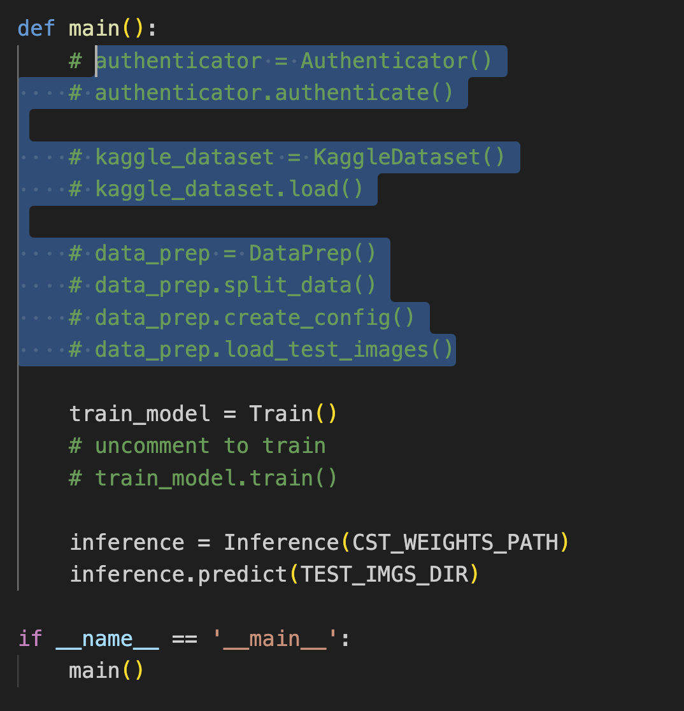

INT-2024 RSNA Pneumonia Detection Challenge
==============================

# Introduction

This repository contains our implementation of the YOLOv8 model on [RSNA Pneumonia Detection Challenge Dataset](https://www.kaggle.com/competitions/rsna-pneumonia-detection-challenge/overview). By running main.py, you can directly download and save dataset locally. Then we can either train the new YOLOv8 through `train.py` file or load weights of our pretrained YOLOv8 model (trained on 100 epochs) through `inference.py`. 

To install the project, in the root directory run:

`pip3 install -r requirements.txt`

Please note that after running the project yo'll be prompted to enter your Kaggle credentials to download the dataset.

After running the model and prediction, you'll find the submission 

`pneumonia-detection/int-obj-detection/reports/submission.csv`

# YOLOv8 Model

Ultralytics YOLOv8 is a cutting-edge, state-of-the-art model that builds upon the success of previous YOLO versions and introduces new features and improvements to further boost performance and flexibility.

Here are couple of the reasons why we choce of YOLO v8 as our model:

1. Enhanced Accuracy: YOLO v8 variants, such as v8-CSPDarknet and v8-Panet, offer improved accuracy due to their advanced feature representation and fusion techniques. This higher precision makes YOLO v8 more reliable for complex applications such as autonomous vehicles and medical imaging.

2. Real-time Performance: YOLO v8 maintains YOLO’s hallmark real-time performance while achieving better accuracy.

3. Versatility: With a range of variants to suit specific needs, YOLO v8 can be customized to suit a variety of applications including detection of objects on medical images

# Project Organization
------------

    ├── LICENSE
    ├── README.md          
    ├── data
    │   ├── processed      
    |   ├── test 
    │   └── raw             
    │
    ├── notebooks          
    │
    ├── reports            
    │   └── submission.csv        
    │
    ├── requirements.txt   
    │                                   
    ├── src                
    │   ├── __init__.py    
    │   │
    │   ├── data           
    │   │   ├── authenticator.py
    │   │   ├── data_prep.py
    │   │   ├── data_prep.py
    |   |   ├── file_helper.py
    |   |   ├── kaggle_dataset.py
    |   |   └── path.py
    │   │
    │   ├── models  
    |   |   ├── weights      
    |   |   |   └── best.pt       
    |   |   ├── __init__.py       
    │   │   ├── inference.py         
    │   │   ├── path.py
    |   |   └──  train.py

--------

# Troubleshooting

You may incounter this type of error before running predictions.

if this happens, please run 

`/usr/local/bin/python3 -m pip`

in your terminal. After that, comment out this part of `main.py` file to avoid loading dataset again:

After that you'll successfully run predictions and will be able to access the submission file: `pneumonia-detection/int-obj-detection/reports/submission.csv`.